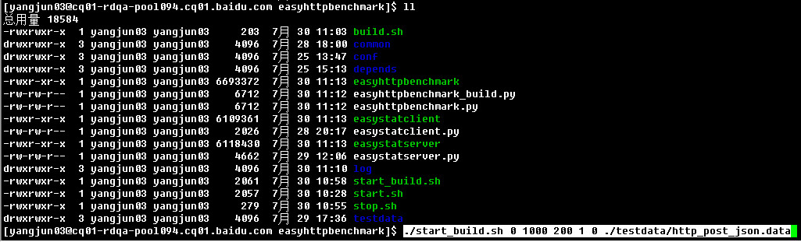
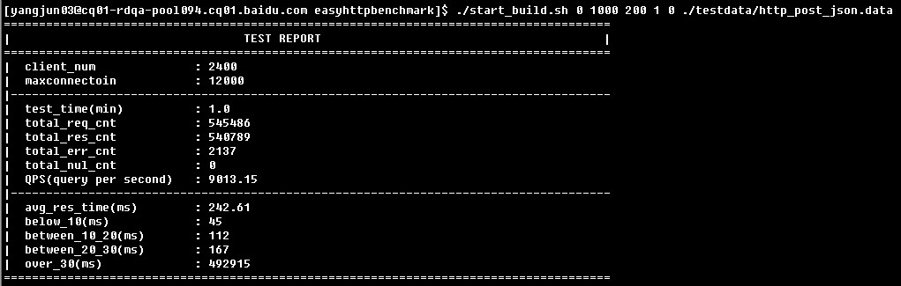
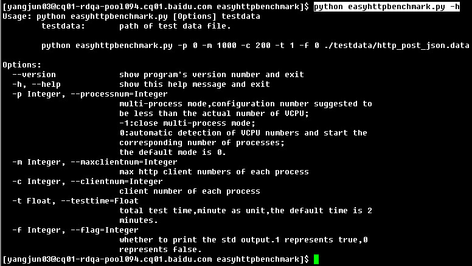
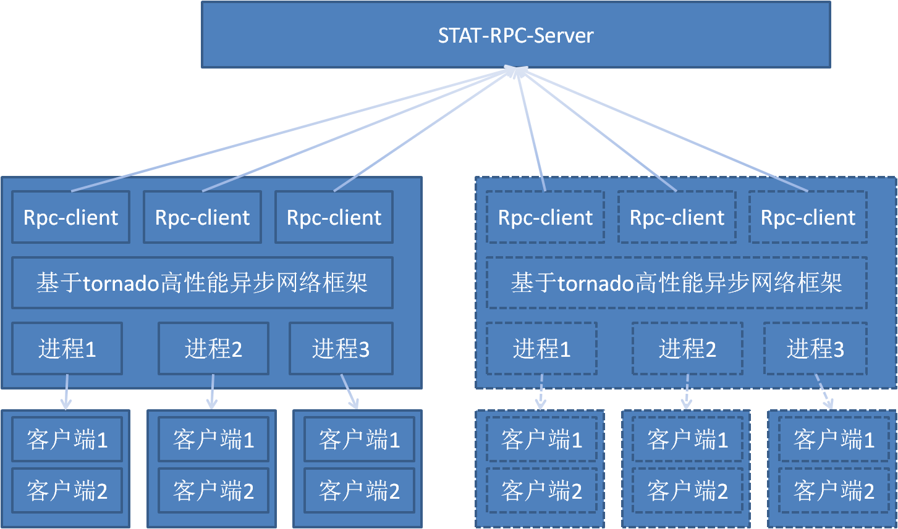

http-benchmark-tornado
=================

高性能http性能测试工具，web性能测试首选。解决业界web测试工具压力不足、压力不均匀、统计输出不完备、扩展不灵活等所有缺陷。 测试工具参数配置灵活，可满足一般性能测试、延迟测试、最大连接数测试、吞吐量测试、压力测试、长时间稳定性测试、内存泄漏测试等场景。测试工具基于频繁的业务测试不断优化改进，稳定可靠、实用性强。   

### Feature:
* 高性能，基于开源异步网络框架tornado开发，单机QPS轻松达到15000左右。  
* 支持随机发送。
* 支持进程数、最大连接数、客户端个数、测试时间、是否打印输出结果、测试数据等灵活配置。     
* 统计输出完备，支持QPS统计、延迟统计、连接数统计。    
* 结构灵活，可方便扩展成多机结构。  
* 免安装，下载直接使用。     
* 支持自动发送测试报告邮件。      
* 固定QPS模式实际应用很少，暂不考虑此功能。      
 
### Dependencies(ignore):    
* tornado=>>http://www.tornadoweb.org/en/stable/     
* pyinstaller=>>http://www.pyinstaller.org/     

### Usage:
* 运行如下命令一键式启动性能测试：    
./start_build.sh 0 1000 200 1 0 ./testdata/http_post_json.data
     
* 测试报告如下:    

* 命令行参数解释如下:    

### Framework:    
* 测试工具架构如下：    
     

